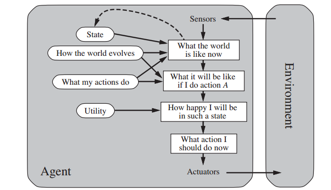
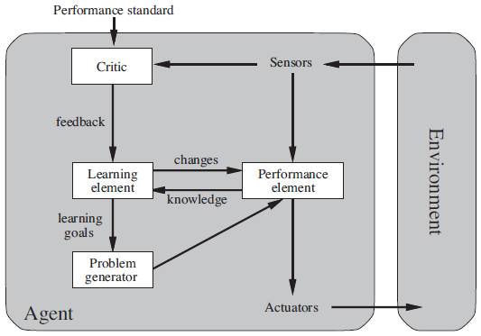

<!-- GitHub Badges/Shields -->
<!-- See https://shields.io/ for more options. -->
[![CI/CD][cicd-shield]][cicd-url]
[![Contributors][contributors-shield]][contributors-url]
[![Forks][forks-shield]][forks-url]
[![Stargazers][stars-shield]][stars-url]
[![Issues][issues-shield]][issues-url]
[![License][license-shield]][license-url]
-----
<br />
<p align="center">
<!-- PROJECT LOGO -->
<a href="">
    
</a>

<!-- PROJECT TITLE -->
<h1 align="center">GeneralAgent</h1>

<p align="center">
    <!-- SHORT PROJECT DESCRIPTION -->
    Python module for building general agents
    <br />
    <!-- LINK TO DOCUMENTATION -->
    <a href="https://samipilino.github.io/GeneralAgent/"><strong>Explore the docs »</strong></a>
    <br />
    <br />
    <!-- LINK TO DEMO
    <a href="INSERT LINK TO DEMO HERE">View Demo</a>
    · -->
    <!-- LINK TO ISSUES -->
    <a href="https://github.com/SamiPilino/GeneralAgent/issues">Report Bug</a>
    ·
    <!-- LINK TO ISSUES -->
    <a href="https://github.com/SamiPilino/GeneralAgent/issues">Request Feature</a>
</p>
</p>

Table of Contents
---------------------
- [About the Project](#about-the-project)
- [Prerequisites](#prerequisites)
- [Getting Started](#getting-started)
- [Usage](#usage)
<!-- - [Roadmap](#roadmap) -->
<!-- - [FAQ](#faq) -->
- [Contributing](#contributing)
- [License](#license)
- [Contacts](#contacts)
<!-- - [Support the Project](#donate) -->
<!-- - [Acknowledgements](#acknowledgements) -->

<a name="about-the-project"></a>
About the Project
---------------------
<!-- A brief description of what this project does and who it's for -->
This project is an attempt at describing the main parts of an AI/ML agent, whether it's just a simple reflex agent, model-based reflex agent, goal-based agent, or a utility agent. It is intented to make it easier to automate a wide variety of tasks by allowing developers to focus more on improving and optimizing the agent's main components rather than having to worry about how those components fit together to form the whole agent, and by breaking the process into smaller steps that build upon each other as the agent's capabilities are expanded and iterated upon.

<center>
    
</center>

This complexity progression for AI/ML agents is defined as follows:

1. "Agent" always performs the same **Action** and the output is always the same regardless of the input
    - i.e. An "agent" that always prints out "Hello, World!"
2. "Agent" always performs the same Action, but the output changes based on the input **Parameters**
    - i.e. An "agent" that always doubles the input
3. Agent uses the input and some **Conditional Logic** to decide which action to perform
    - i.e. An agent that can either add, subtract, multiply, or divide a number depending on the command you provide
4. Agent can keep track of previous **States** so it doesn't have to depend completely upon the current precept
    - i.e. An robotic lawnmower agent that remembers where it has already mowed so that it doesn't try to mow grass that has already been mowed
5. Agent can update its mental "snapshots" according to some **System Dynamics** (Understanding about how the relevant environment changes over time assuming no action from the agent)
6. Agent can update its mental "snapshots" according to some **Control Dynamics** (Understanding about how the relevant environment changes as a result of the agent's actions)
7. Agent can use the System and Control Dynamics to **Speculate** about possible future states caused by taking performing certain actions
8. Agent can determine the usefulness of possible future states using a **Utility Function**
9. Agent uses a **Critic** to measure its performance
10. Agent uses the Critic to compare its performance to some **Performance Standard** (which can be either internal or, perhaps more likely, external)
11. Agent uses a **Learning Element** to adjust the performance parameters of the performance element based on feedback from the Critic
12. Agent uses a **Problem Generator** to create practice problems to challenge itself to learn concepts it doesn't understand very well
13. Agent continues to improve its Speculator by actively trying to learn and anticipate the actions of **Other Agents** and how they could affect the environment as well as the agent's own decision-making process
14. Agent focuses on **Competition** with other agents
15. Agent focuses on **Communication, Negotiation, and Other Collaborative Efforts** with other agents so that it no longer has to compete for resources

<a name="prerequisites"></a>
Prerequisites
---------------------
<!-- This section should list any major frameworks that you built your project using. Leave any add-ons/plugins for the Acknowledgements section. Here are a few examples.-->
- [Python3](https://www.python.org/)

<a name="getting-started"></a>
Getting Started
---------------------
<!-- This is an example of how you may give instructions on setting up your project locally. To get a local copy up and running follow these simple example steps. -->
1. Clone this repo into your project as `agents/`
    ```
    $ git clone https://github.com/SamiPilino/GeneralAgent.git agents/
    ```

<a name="usage"></a>
Usage
------
1. Import the agent component types you need for your project
    ```python
    from agents import Agent, Action, Speculator, PerformanceElement
    ```
2. Import your agent component definitions
    ```python
    import my_agent
    ```
3. Import your action modules
    ```python
    import my_action_module
    ```
4. Describe how to initialize and run the agent
    ```python
    # agent.py In your project's root directory
    def main():
        # Define actions the agent can take
        actions = [
            Action("Agent Main Loop", my_action_module.main, input_types="PreviousState", output_types="NextState")
        ]

        # Initialize the agent
        agent = Agent(
            PerformanceElement(
                actions,
                my_agent.conditionalLogic,
                Speculator(
                    my_agent.systemDynamics,
                    my_agent.controlDynamics
                ),
                my_agent.utilityFunction
            )
        )

        # Define the starting state
        initial_state = {}

        # Run the agent
        agent.run(initial_state)

    if __name__ == '__main__':
        main()
    ```
5. Run your agent with
    ```
    $ python agent.py
    ```
<!-- 
<a name="roadmap"></a>
Roadmap
----------
See the [open issues][issues-url] for a list of proposed features (and known issues). -->
<!--
<a name="faq"></a>
FAQ
----
-->

<a name="contributing"></a>
Contributing
---------------
Contributions are what make the open source community such an amazing place to be learn, inspire, and create. Any contributions you make are **greatly appreciated**.

1. Fork the project
2. Create your feature branch (`git checkout -b username/amazing-feature`)
3. Commit your changes (`git commit -m 'Add some amazing feature'`)
4. Push to the branch (`git push origin username/amazing-feature`)
5. Open a pull request onto the `develop` branch of the official repository

<a name="license"></a>
License
-----------
Distributed under the GNU Public License. See [`LICENSE`][license] for more information.

<a name="contacts"></a>
Contacts
-----------
<!-- Your Name - [@github_username][link-to-github-user] -->
**Maintainer**: [@samipilino][samipilino]
<!-- 
<a name="donate"></a>
Support the Project
--------------------
[Donate to HART][donate-url]
-->
<!--
<a name="acknowledgements"></a>
Acknowledgements
-----------------
- [GitHub Emoji Cheat Sheet](https://www.webpagefx.com/tools/emoji-cheat-sheet)
- [Img Shields](https://shields.io)
- [Choose an Open Source License](https://choosealicense.com)
- [GitHub Pages](https://pages.github.com)
- [Animate.css](https://daneden.github.io/animate.css)
- [Loaders.css](https://connoratherton.com/loaders)
- [Slick Carousel](https://kenwheeler.github.io/slick)
- [Smooth Scroll](https://github.com/cferdinandi/smooth-scroll)
- [Sticky Kit](http://leafo.net/sticky-kit)
- [JVectorMap](http://jvectormap.com)
- [Font Awesome](https://fontawesome.com)
-->
<!-- MARKDOWN LINKS & IMAGES -->
<!-- https://www.markdownguide.org/basic-syntax/#reference-style-links -->
[cicd-shield]: https://github.com/SamiPilino/GeneralAgent/workflows/Documentation/badge.svg?branch=develop
[cicd-url]: https://github.com/SamiPilino/docs/actions "Documentation"
[contributors-shield]: https://img.shields.io/github/contributors/SamiPilino/GeneralAgent
[contributors-url]: https://github.com/SamiPilino/GeneralAgent/graphs/contributors
[forks-shield]: https://img.shields.io/github/forks/SamiPilino/GeneralAgent
[forks-url]: https://github.com/SamiPilino/GeneralAgent/network/members
[stars-shield]: https://img.shields.io/github/stars/SamiPilino/GeneralAgent
[stars-url]: https://github.com/SamiPilino/GeneralAgent/stargazers
[issues-shield]: https://img.shields.io/github/issues/SamiPilino/GeneralAgent
[issues-url]: https://github.com/SamiPilino/GeneralAgent/issues
[license-shield]: https://img.shields.io/github/license/SamiPilino/GeneralAgent
[license-url]: https://github.com/SamiPilino/GeneralAgent/blob/main/LICENSE
[license]: ./LICENSE "GNU Public License"
[samipilino]: https://github.com/samipilino
